# Breadboard: Soji M1.5 — Workspace Observability

## Places

| #    | Place               | Description |
|------|---------------------|-------------|
| P1   | Workspace Mode TUI  | Main Workspace Mode view — left nav panel + right detail panel. Active when Soji runs inside a workspace CWD. |
| P1.1 | Left Nav Panel      | Subplace of P1. Navigable list of surfaces, section headers, and (when expanded) child data rows. User's primary interaction zone. |
| P1.2 | Right Detail Panel  | Subplace of P1. Read-only detail view driven by the left panel cursor. No independent interaction in M1.5. |
| P2   | Source Layer        | Async data gathering. Not navigable — runs concurrently at snapshot time and populates domain types. |

> The blocking test: P1.1 and P1.2 are in the same Place (P1) — you can see both simultaneously and left-panel navigation directly drives right-panel content. There is no blocking interaction between them. P2 is not a navigable place — it's the async backend equivalent.

---

## UI Affordances

### P1.1: Left Nav Panel — Section Headers

| #   | Place | Component        | Affordance                                                              | Control | Wires Out        | Returns To |
|-----|-------|------------------|-------------------------------------------------------------------------|---------|------------------|------------|
| U1  | P1.1  | `left.rs`        | ENV section header (collapsed): `ENV  N vars · M missing  ›`           | render  | —                | —          |
| U2  | P1.1  | `left.rs`        | ENV section header (expanded): `ENV  N vars · M missing  ∨`            | render  | —                | —          |
| U3  | P1.1  | `left.rs`        | SECRETS section header: `SECRETS  N entries · M missing  ›/∨`          | render  | —                | —          |
| U4  | P1.1  | `left.rs`        | GIT section header: `GIT  branch · [dirty]  ›/∨`                       | render  | —                | —          |
| U5  | P1.1  | `left.rs`        | GITHUB section header: `GITHUB  N milestones open  ›/∨`                | render  | —                | —          |
| U6  | P1.1  | `left.rs`        | CONFIG section header: `CONFIG  N files present  ›/∨`                  | render  | —                | —          |

### P1.1: Left Nav Panel — Child Rows (visible only when parent section expanded)

| #   | Place | Component        | Affordance                                                              | Control | Wires Out        | Returns To |
|-----|-------|------------------|-------------------------------------------------------------------------|---------|------------------|------------|
| U7  | P1.1  | `left.rs`        | EnvVar row: `[✓/✗] VAR_NAME  source  [🔑 icon if secret]`              | render  | —                | —          |
| U8  | P1.1  | `left.rs`        | SecretRow: `[✓/✗/⚠] scope/cat/key  [ws/shared badge]`                 | render  | —                | —          |
| U9  | P1.1  | `left.rs`        | WorktreeRow: `● path  branch  [dirty]`                                  | render  | —                | —          |
| U10 | P1.1  | `left.rs`        | MilestoneRow: `title  N open / M closed`                               | render  | —                | —          |
| U11 | P1.1  | `left.rs`        | IssueRow (under expanded milestone): `#N title  [label chip]`          | render  | —                | —          |
| U12 | P1.1  | `left.rs`        | ConfigFileRow: `filename  [✓ present / — absent]`                      | render  | —                | —          |

### P1.1: Left Nav Panel — Interaction Affordances

| #   | Place | Component        | Affordance                                                                      | Control | Wires Out          | Returns To |
|-----|-------|------------------|---------------------------------------------------------------------------------|---------|-------------------|------------|
| U13 | P1.1  | `events.rs`      | ↑/↓ navigation — moves cursor through nav list                                   | key     | → N12             | —          |
| U14 | P1.1  | `events.rs`      | Enter on expandable NavItem (SectionHeader or MilestoneRow) — toggle expand/collapse | key | → N15             | —          |
| U17 | P1.1  | `events.rs`      | Esc — collapse currently expanded section / clear selection                      | key     | → N11             | —          |

### P1.2: Right Detail Panel — Section Detail Views

| #   | Place | Component        | Affordance                                                                      | Control | Wires Out | Returns To |
|-----|-------|------------------|---------------------------------------------------------------------------------|---------|-----------|------------|
| U20 | P1.2  | `right.rs`       | ENV section detail: table of all declared vars (name, source, ks_path?, loaded, sensitive) | render | — | —  |
| U21 | P1.2  | `right.rs`       | SECRETS section detail: manifest grouped by scope (shared first), three-state per entry | render | — | — |
| U22 | P1.2  | `right.rs`       | GIT section detail: branch + ahead/behind + dirty + stash count + worktrees table | render | — | — |
| U23 | P1.2  | `right.rs`       | GITHUB section detail: milestone list with open/closed counts + progress indicators; labels panel below showing all labels in use across open issues | render | — | — |
| U24 | P1.2  | `right.rs`       | Milestone detail (when MilestoneRow selected): issue list with #, title, labels  | render  | —         | —          |
| U25 | P1.2  | `right.rs`       | CONFIG section detail: file list with presence; .envrc row selected → content viewer | render | — | — |
| U26 | P1.2  | `right.rs`       | .envrc content viewer: file contents read-only (no values — .envrc has no values) | render | — | — |
| U27 | P1.2  | `right.rs`       | Empty/unavailable states: "no .envrc found", "gh auth required", "git not found" | render | — | — |

---

## Code Affordances

### P2: Source Layer — New Modules

| #   | Place | Module              | Affordance                                                                                    | Control | Wires Out    | Returns To |
|-----|-------|---------------------|-----------------------------------------------------------------------------------------------|---------|--------------|------------|
| N1  | P2    | `sources/env.rs`    | `EnvSource::gather(cwd)` — parses `.envrc` at cwd (regex: `export VAR=...` and `export VAR=$(secret path)`). For each var: `loaded = std::env::var(&name).is_ok()`. `is_sensitive` heuristic on name. | call | → S1 (via N6 → N14) | → WorkspaceEnv |
| N2  | P2    | `sources/secrets.rs`| `SecretsSource::gather(cwd, env_vars)` — extracts ks paths from env_vars where ks_path is Some. Runs `ks ls` once. Three-state per SecretRef: declared + exists_in_keychain + loaded. Parses scope from path prefix. | call | → S2 (via N6 → N14) | → WorkspaceSecrets |
| N3  | P2    | `sources/git.rs`    | `GitSource::gather(cwd)` — shells out: `git -C cwd rev-parse --abbrev-ref HEAD`, `git status --porcelain`, `git worktree list --porcelain`, `git stash list`, `git rev-list --count @{u}..HEAD` (best-effort). | call | → S3 (via N6 → N14) | → Option<WorkspaceGit> |
| N4  | P2    | `sources/github.rs` | `GitHubSource::gather(cwd)` — parses org/repo from `git remote get-url origin`. Auth gate: `gh auth status` exit code. Calls `gh api repos/{owner}/{repo}/milestones` (fields: title, number, open_issues, closed_issues). Calls `gh issue list --state open --json number,title,labels` (labels are `{ name, ... }` objects). Aggregates labels on open issues. | call | → S4 (via N6 → N14) | → Option<WorkspaceGithub> |
| N5  | P2    | `sources/config.rs` | `ConfigSource::scan(cwd)` — `std::fs::metadata` checks for: `.envrc`, `docker-compose.yml`, `docker-compose.yaml`, `soji.toml`, `Makefile`, `Cargo.toml`, `package.json`. Globs `.env*` variants. | call | → S5 (via N6 → N14) | → ConfigFiles |
| N6  | P2    | `sources/mod.rs`    | `gather_snapshot()` — extended. Runs N1 first (sequential). Passes N1 output to N2 (avoids double `.envrc` parse). Then runs N2, N3, N4, N5 concurrently via `tokio::join!(N2, N3, N4, N5)`. Attaches results to each workspace in workspaces vec. | call | → N1, then N2, N3, N4, N5 | → EnvironmentSnapshot |

### P1: Domain Layer — New Types

| #   | Place | Module                   | Affordance                                                                                                                            | Control | Wires Out | Returns To |
|-----|-------|--------------------------|---------------------------------------------------------------------------------------------------------------------------------------|---------|-----------|------------|
| N7  | P1    | `domain/workspace.rs`    | New types: `WorkspaceEnv`, `EnvVar`, `EnvVarSource`, `WorkspaceSecrets`, `SecretRef`, `SecretScope`, `WorkspaceGit`, `WorktreeInfo`, `WorkspaceGithub`, `Milestone`, `Issue`, `ConfigFiles`. New fields on `Workspace`: `env`, `secrets`, `git`, `github`, `config_files` (all `Option<T>`). | define | → used by N1–N5 and TUI | — |

### P1: TUI App State — Extensions

| #   | Place | Module           | Affordance                                                                                                                                   | Control | Wires Out     | Returns To |
|-----|-------|------------------|----------------------------------------------------------------------------------------------------------------------------------------------|---------|---------------|------------|
| N8  | P1    | `tui/app.rs`     | New `NavItem` variants: `EnvVarRow(usize)`, `SecretRow(usize)`, `WorktreeRow(usize)`, `MilestoneRow(usize)`, `IssueRow(usize, usize)`, `ConfigFileRow(String)` | define | → used by N9, N12, N13 | — |
| N9  | P1    | `tui/app.rs`     | New `SectionKind` variants: `Github`, `Config`. `SectionKind::key() -> &str` method for expand hashset keying. | define | → used by N10, N11, N13 | — |
| N10 | P1    | `tui/app.rs`     | `update_nav_workspace()` extended — after each SectionHeader, if `expanded.contains("section:<kind>")`, emits child rows: EnvVarRow per env var, SecretRow per secret, WorktreeRow per worktree, MilestoneRow per milestone (and IssueRow per issue if milestone expanded), ConfigFileRow per file. | call | → S7 | — |
| N11 | P1    | `tui/app.rs`     | `toggle_expand()` extended — handles `NavItem::SectionHeader(kind)`: keys `"section:env"`, `"section:secrets"`, `"section:git"`, `"section:github"`, `"section:config"`. Also handles `NavItem::MilestoneRow(idx)` keyed as `"milestone:N"`. Calls `update_nav()`. | call | → S6, → N10 | — |
| N12 | P1    | `tui/app.rs`     | `move_cursor(delta)` — increments or decrements `app.cursor` by delta, clamped to `[0, app.nav.len() - 1]`. Detail type is implicitly derived from the NavItem variant at the new cursor position via `selected_item()`. | call | → S8 | — |
| N14 | P1    | `tui/app.rs`     | `App::update_snapshot()` — receives enriched EnvironmentSnapshot with workspace.env/secrets/git/github/config_files populated. Replaces `self.workspace` and triggers `update_nav()`. | call | → S1–S5 (via workspace), → N10 | — |

### P1: TUI Events — Extensions

| #   | Place | Module           | Affordance                                                                                                                    | Control | Wires Out | Returns To |
|-----|-------|------------------|-------------------------------------------------------------------------------------------------------------------------------|---------|-----------|------------|
| N15 | P1    | `tui/events.rs`  | `handle_enter()` extended — dispatches on current `NavItem`: `SectionHeader(kind)` → `toggle_expand(SectionHeader(kind))` (N11); `MilestoneRow(i)` → `toggle_expand(MilestoneRow(i))` (N11); all other leaf rows → no-op (detail already shown by cursor position). | call | → N11 | — |

### P1: TUI UI Rendering — Extensions

| #   | Place | Module           | Affordance                                                                                                                                             | Control | Wires Out       | Returns To |
|-----|-------|------------------|--------------------------------------------------------------------------------------------------------------------------------------------------------|---------|-----------------|------------|
| N16 | P1    | `tui/ui/left.rs` | `draw_left()` extended — renders new `NavItem` variants: `EnvVarRow` → U7, `SecretRow` → U8, `WorktreeRow` → U9, `MilestoneRow` → U10, `IssueRow` → U11, `ConfigFileRow` → U12. Section headers render toggle indicator and live summary badge. | call | → U1–U12 | — |
| N17 | P1    | `tui/ui/right.rs`| `draw_right()` extended — dispatches on `app.selected_item()`: `SectionHeader(Env)` → U20, `SectionHeader(Secrets)` → U21, `SectionHeader(Git)` → U22, `SectionHeader(Github)` → U23, `MilestoneRow(i)` → U24, `SectionHeader(Config)` / `ConfigFileRow(".envrc")` → U25/U26, `EnvVarRow(i)` → env var detail, `SecretRow(i)` → secret detail. Absent data → U27. | call | → U20–U27 | — |

---

## Data Stores

| #   | Place | Store                         | Description                                                         |
|-----|-------|-------------------------------|---------------------------------------------------------------------|
| S1  | P2→P1 | `workspace.env`               | `Option<WorkspaceEnv>` — env vars declared in .envrc, with loaded/sensitive flags. Written by N1 via N6/N14. Read by N10, N16, N17. |
| S2  | P2→P1 | `workspace.secrets`           | `Option<WorkspaceSecrets>` — secret manifest with three-state. Written by N2. Read by N10, N16, N17. |
| S3  | P2→P1 | `workspace.git`               | `Option<WorkspaceGit>` — branch, dirty, worktrees, stash count. Written by N3. Read by N10, N16, N17. |
| S4  | P2→P1 | `workspace.github`            | `Option<WorkspaceGithub>` — milestones, issues, labels. Written by N4. Read by N10, N16, N17. |
| S5  | P2→P1 | `workspace.config_files`      | `Option<ConfigFiles>` — file presence flags. Written by N5. Read by N10, N16, N17. |
| S6  | P1    | `app.expanded: HashSet<String>` | Tracks which sections/milestones are expanded. Keys: `"section:env"`, `"section:secrets"`, `"section:git"`, `"section:github"`, `"section:config"`, `"milestone:N"`. Written by N11. Read by N10. |
| S7  | P1    | `app.nav: Vec<NavItem>`       | Ordered list of navigable items. Rebuilt by N10 on any nav update. Read by N16 (left panel), N15 (event dispatch). |
| S8  | P1    | `app.cursor: usize`           | Current cursor position in nav list. Written by N12. Read by N17 (right panel), N15, N16. |

---

## Wiring Diagrams

### Flow 1: Snapshot gather populates workspace observability data

```
gather_snapshot()  ←N6
    ──► EnvSource::gather(cwd)              N1  ──► WorkspaceEnv          ──► workspace.env     S1
          │ env_vars (passed to N2)
          ▼
    (then concurrently via tokio::join!(N2, N3, N4, N5):)
    ├──► SecretsSource::gather(cwd, &env_vars) N2  ──► WorkspaceSecrets    ──► workspace.secrets S2
    ├──► GitSource::gather(cwd)              N3  ──► Option<WorkspaceGit>  ──► workspace.git     S3
    ├──► GitHubSource::gather(cwd)           N4  ──► Option<WorkspaceGithub> ──► workspace.github S4
    └──► ConfigSource::scan(cwd)             N5  ──► ConfigFiles           ──► workspace.config  S5

App::update_snapshot(snapshot)  ←N14
    ──► self.workspace = detect_workspace(&snapshot, ...)
    ──► update_nav()  ──► N10
```

### Flow 2: Section header expand — ENV example

```
User presses Enter on ENV header  U14
    ──► handle_enter()            N15
    ──► toggle_expand(SectionHeader(Env))  N11
          ──► key = "section:env"
          ──► [if in expanded] ──► expanded.remove(key)   S6
          ──► [if not in expanded] ──► expanded.insert(key)  S6
          ──► update_nav()      N10
                ──► reads workspace.env  S1
                ──► for each EnvVar: push NavItem::EnvVarRow(i)  ──► S7
    ──► draw_left() re-renders   N16
          ──► renders EnvVar rows U7 for each env var in expanded section
    ──► draw_right() re-renders  N17
          ──► cursor still on SectionHeader(Env) ──► U20 (ENV section detail)
```

### Flow 3: Child row selection — SecretRow detail

```
User navigates ↑↓ to a SecretRow  U13
    ──► move_cursor(delta)        N12  ──► S8 (cursor updated)
    ──► draw_right() re-renders    N17
          ──► selected_item() = NavItem::SecretRow(i)
          ──► reads workspace.secrets.refs[i]  S2
          ──► renders: ks_path, scope badge, exists_in_keychain, loaded status
          ──► [if !exists_in_keychain] ──► shows "ks add <path>" hint
```

### Flow 4: GITHUB milestone expansion

```
User presses Enter on MilestoneRow(i)  U14
    ──► handle_enter()            N15
    ──► toggle_expand(MilestoneRow(i))  N11
          ──► key = "milestone:i"
          ──► S6 updated (milestone:i inserted/removed)
          ──► update_nav()  N10
                ──► reads workspace.github.milestones[i].issues  S4
                ──► for each Issue: push NavItem::IssueRow(i, j)  S7
    ──► draw_left() re-renders  N16
          ──► renders IssueRow entries U11 under the expanded milestone

User navigates to IssueRow(i, j)
    ──► draw_right() N17
          ──► renders: #number, title, all labels with color chips
```

### Flow 5: CONFIG .envrc content viewer

```
User navigates to ConfigFileRow(".envrc")  via U12
    ──► draw_right() N17
          ──► selected_item() = NavItem::ConfigFileRow(".envrc")
          ──► reads workspace.config_files.has_envrc  S5
          ──► [if present] ──► reads file contents from disk ──► U26 (.envrc viewer)
          ──► [if absent]  ──► U27 ("no .envrc found")
```

### Flow 6: Graceful degradation

```
[ks not installed]
    SecretsSource::gather()  N2
        ──► which("ks") fails
        ──► returns WorkspaceSecrets { refs: [], unavailable_reason: Some("ks not installed") }
        ──► draw_right() N17 → U27 "SECRETS unavailable — ks not installed"

[gh not authed]
    GitHubSource::gather()  N4
        ──► gh auth status → non-zero exit
        ──► returns WorkspaceGithub { auth_available: false, milestones: [], ... }
        ──► GITHUB section header: "GITHUB  auth required"
        ──► draw_right() N17 → U27 "GitHub: run `gh auth login`"

[no .envrc]
    EnvSource::gather()  N1
        ──► std::fs::read_to_string(".envrc") fails
        ──► returns WorkspaceEnv { vars: [], envrc_present: false }
        ──► ENV section header: "ENV  no .envrc"
```

---

## Vertical Slices

| #   | Slice                             | Shape Parts                      | Demo |
|-----|-----------------------------------|----------------------------------|------|
| VS1 | ENV section — declared vs. loaded | A1 (env types), A2, partial A7, A8 (EnvVarRow), N9 (Env kind), A9 (left ENV render), partial A10 (right ENV detail) | "ENV shows 12 vars, 2 missing. Expand: ANTHROPIC_API_KEY ✓, MOKUMO_DB_DIRECT_URL ✗. Select var: right panel shows ks path + source." |
| VS2 | SECRETS section — three-state manifest | A1 (secrets types), A3, partial A7, A8 (SecretRow), A9 (left SECRETS render), partial A10 (right SECRETS detail) | "SECRETS shows 15 entries. mokumo/* workspace-bound, shared/* org-level. 14 loaded ✓, 1 ✗ missing (entry doesn't exist in keychain)." |
| VS3 | GIT section — local state         | A1 (git types), A4, partial A7, A8 (WorktreeRow), A9 (left GIT render), partial A10 (right GIT detail) | "GIT shows main branch, clean, 2 worktrees — snoopy-juggling-clock is dirty. 0 stashes." |
| VS4 | GITHUB section — milestones + issues | A1 (github types), A5, partial A7, A11 (Github kind), A8 (MilestoneRow/IssueRow), A9 (left GITHUB render), partial A10 (right GITHUB detail) | "GITHUB shows 7 milestones. M1.5 has 9 open. Enter to expand: issue list with type:feature, type:design labels. Labels panel shows 8 distinct labels on open issues." |
| VS5 | CONFIG section + .envrc viewer    | A1 (config types), A6, partial A7, A11 (Config kind), A8 (ConfigFileRow), A9 (left CONFIG render), partial A10 (right CONFIG + .envrc viewer) | "CONFIG shows .envrc ✓, Cargo.toml ✓, no soji.toml, no docker-compose. Navigate to .envrc: right panel shows file contents." |

> **Dependency order:** VS1 must come first — it establishes the section expand/collapse pattern (N8–N11, N15) that all subsequent slices reuse. VS2 depends on VS1 (uses env_vars param from N1). VS3, VS4, VS5 are independent of each other after VS1.

---

## Mermaid Diagram

```mermaid
flowchart TB

subgraph P2["P2: Source Layer"]
    N6["N6: gather_snapshot()"]
    N1["N1: EnvSource::gather()"]
    N2["N2: SecretsSource::gather()"]
    N3["N3: GitSource::gather()"]
    N4["N4: GitHubSource::gather()"]
    N5["N5: ConfigSource::scan()"]
end

subgraph P1["P1: Workspace Mode TUI"]
    N14["N14: update_snapshot()"]
    N7["N7: domain types (WorkspaceEnv, etc.)"]
    N9["N9: SectionKind (Github, Config)"]
    N8["N8: NavItem variants"]
    N11["N11: toggle_expand()"]
    N10["N10: update_nav_workspace()"]
    N15["N15: handle_enter()"]

    subgraph P1_1["P1.1: Left Nav Panel"]
        U1["U1: ENV header"]
        U3["U3: SECRETS header"]
        U4["U4: GIT header"]
        U5["U5: GITHUB header"]
        U6["U6: CONFIG header"]
        U7["U7: EnvVar row"]
        U8["U8: SecretRow"]
        U9["U9: WorktreeRow"]
        U10["U10: MilestoneRow"]
        U11["U11: IssueRow"]
        U12["U12: ConfigFileRow"]
        U14["U14: Enter (expandable item)"]
        U13["U13: ↑/↓ nav"]
        N12["N12: move_cursor()"]
        N16["N16: draw_left()"]
    end

    subgraph P1_2["P1.2: Right Detail Panel"]
        U20["U20: ENV detail"]
        U21["U21: SECRETS detail"]
        U22["U22: GIT detail"]
        U23["U23: GITHUB detail"]
        U24["U24: Milestone detail"]
        U25["U25: CONFIG detail"]
        U26["U26: .envrc viewer"]
        U27["U27: empty/error states"]
        N17["N17: draw_right()"]
    end

    S1["S1: workspace.env"]
    S2["S2: workspace.secrets"]
    S3["S3: workspace.git"]
    S4["S4: workspace.github"]
    S5["S5: workspace.config_files"]
    S6["S6: app.expanded"]
    S7["S7: app.nav"]
    S8["S8: app.cursor"]
end

%% Source gather flow (N1 sequential, then N2–N5 concurrent)
N6 --> N1
N1 -.-> S1
N1 -->|env_vars| N2
N6 --> N2 & N3 & N4 & N5
N2 -.-> S2
N3 -.-> S3
N4 -.-> S4
N5 -.-> S5
N6 --> N14

%% Snapshot → app state
N14 --> N10
S1 & S2 & S3 & S4 & S5 -.-> N10

%% Nav rebuild
N10 --> S7
S6 -.-> N10

%% Left panel rendering
S7 -.-> N16
S1 & S2 & S3 & S4 & S5 -.-> N16
N16 --> U1 & U3 & U4 & U5 & U6
N16 --> U7 & U8 & U9 & U10 & U11 & U12

%% Interaction: expand (U14 → N15 → N11)
U14 --> N15
N15 --> N11
N11 --> S6
N11 --> N10

%% Interaction: navigate (U13 → N12 → S8)
U13 --> N12
N12 --> S8

%% Right panel rendering (cursor-driven)
S8 -.-> N17
S1 & S2 & S3 & S4 & S5 -.-> N17
N17 --> U20 & U21 & U22 & U23 & U24 & U25 & U26 & U27

classDef ui fill:#ffb6c1,stroke:#d87093,color:#000
classDef code fill:#d3d3d3,stroke:#808080,color:#000
classDef store fill:#e6e6fa,stroke:#9370db,color:#000

class U1,U3,U4,U5,U6,U7,U8,U9,U10,U11,U12,U13,U14,U20,U21,U22,U23,U24,U25,U26,U27 ui
class N1,N2,N3,N4,N5,N6,N7,N8,N9,N10,N11,N12,N14,N15,N16,N17 code
class S1,S2,S3,S4,S5,S6,S7,S8 store
```



---

## Scope Coverage Verification

| Req | Requirement | Affordances | Covered? |
|-----|-------------|-------------|----------|
| R0 | ENV section: `.envrc` parsing, shell env cross-reference, loaded/missing gap, source annotation | N1, N7, N8, N10, N16, U1, U2, U7, U20 | ✅ |
| R1 | SECRETS section: ks path manifest, `ks ls` cross-reference, three-state, values never shown | N2, N7, N8, N10, N16, U3, U8, U21 | ✅ |
| R2 | Secrets scope: `shared/` visually distinct from workspace-scoped | N2 (scope field), N16 (scope badge), U8, U21 | ✅ |
| R3 | GIT section: branch, dirty, worktrees, stash count, ahead/behind | N3, N7, N8, N10, N16, U4, U9, U22 | ✅ |
| R4 | GITHUB section: milestones + issue counts, issue list, labels via `gh` CLI | N4, N7, N8, N9, N10, N11, N16, U5, U10, U11, U23 (includes labels panel), U24 | ✅ |
| R5 | CONFIG section: presence indicators, `.envrc` inline viewer | N5, N7, N8, N9, N10, N16, U6, U12, U25, U26 | ✅ |
| R6 | Section expansion: expandable headers, child NavItem rows | N8, N9, N10, N11, N15, U14, S6, S7 | ✅ |
| R7 | Workspace-level separation: sections at workspace level, not per-surface | domain design in N7; sections only in workspace nav (N10) | ✅ |
| R8 | Graceful degradation: empty states, no panics | N1–N5 each return Option/empty on failure; N17 → U27 | ✅ |

---

## Quality Gate

- [x] Every Place passes the blocking test (P1.1 and P1.2 are in same place; P2 is source layer, not navigable)
- [x] Every R has corresponding affordances (scope coverage table above)
- [x] Every U has a rendering code affordance (N16 feeds P1.1 Ux; N17 feeds P1.2 Ux)
- [x] Every N either has Wires Out or Returns To (sources return to stores; app-layer Ns wire to stores and render fns)
- [x] Every S has at least one reader (S1–S5 read by N10, N16, N17; S6 read by N10; S7 read by N16; S8 read by N17)
- [x] No dangling wire references
- [x] Slices defined with demo statements
- [x] Mermaid matches tables (tables are truth)
- [x] Dependency order noted (VS1 first; VS2 depends on VS1; VS3–VS5 independent after VS1)
- [x] BB reflection applied — 8 smells fixed (see bb-reflection.md)
