# Breadboard: P1 Insight Creation Pipeline

## Places

| #  | Place                         | Description                                                                 |
|----|-------------------------------|-----------------------------------------------------------------------------|
| P1 | CLI: `insight from-report`    | Terminal — `tankyu insight from-report <path> [--dry-run]` command surface  |
| P2 | Backend: InsightFromReport    | Domain orchestration — parse → resolve → upsert → graph edges → write-back |
| P3 | Script: `add-front-matter`    | `tsx scripts/add-front-matter.ts` — retroactive front matter for legacy reports |
| P4 | Dive Skill                    | Agent execution — research, write report with front matter, self-index      |

---

## UI Affordances

| #   | Place | Component     | Affordance                                                          | Control | Wires Out | Returns To |
|-----|-------|---------------|---------------------------------------------------------------------|---------|-----------|------------|
| U1  | P1    | program.ts    | `tankyu insight from-report <path>`                                 | invoke  | → N1      | —          |
| U2  | P1    | program.ts    | `--dry-run` flag                                                    | flag    | → N1      | —          |
| U3  | P1    | cli output    | per-file success: `✓ indexed: <title> [<id>]`                      | render  | —         | —          |
| U4  | P1    | cli output    | per-file update: `↑ updated: <title>`                               | render  | —         | —          |
| U5  | P1    | cli output    | batch summary: `3 indexed, 1 updated, 0 errored`                   | render  | —         | —          |
| U6  | P1    | cli output    | error line: `✗ <file>: <message>` + topic hint if NotFoundError    | render  | —         | —          |
| U7  | P1    | cli output    | dry-run preview: `[dry-run] would index: <title> (topics: X, Y)`   | render  | —         | —          |
| U8  | P3    | script        | `tsx add-front-matter.ts <path> --topic <name> [--type <type>]`    | invoke  | → N30     | —          |
| U9  | P3    | script output | `Skipped (has front matter): <file>`                                | render  | —         | —          |
| U10 | P3    | script output | `Wrote front matter: <file>`                                        | render  | —         | —          |
| U11 | P4    | dive-skill    | research report `.md` file written to `research/`                  | write   | → N40     | —          |

---

## Code Affordances

### P1 — CLI

| #  | Place | Component  | Affordance                                                                           | Control | Wires Out       | Returns To         |
|----|-------|------------|--------------------------------------------------------------------------------------|---------|-----------------|---------------------|
| N1 | P1    | program.ts | `registerInsightCommand(program)` — parse `<path>` + `dryRun` flag, detect file vs dir | call | → N2            | —                  |
| N2 | P1    | program.ts | `fs.stat(path)` — isFile → N3, isDirectory → N4                                     | call    | → N3 or N4      | —                  |
| N3 | P1    | program.ts | single-file dispatch: `InsightFromReport.ingest(filePath, { dryRun })`               | call    | → N10, → U3, → U4, → U6, → U7 | —   |
| N4 | P1    | program.ts | directory dispatch: `InsightFromReport.ingestDirectory(dir, { dryRun })`             | call    | → N23, → U5, → U6, → U7       | —   |

### P2 — Backend: InsightFromReport

| #   | Place | Component               | Affordance                                                                                                     | Control | Wires Out                                   | Returns To   |
|-----|-------|-------------------------|----------------------------------------------------------------------------------------------------------------|---------|---------------------------------------------|--------------|
| N10 | P2    | insight-from-report.ts  | `InsightFromReport.ingest(filePath, { dryRun })` — orchestrates full parse→resolve→upsert→edges flow           | call    | → N11, N12, N13, N14, N15; → N16 (new) or N17 (existing); → N18 (new only); → N19, N20, N21, N22 | → N3 |
| N11 | P2    | report-parser.ts        | `parseReport(filePath)` — read file, slice between `---` delimiters, js-yaml.load, ReportFrontMatterSchema.parse | call  | → S1 read                                   | → N10        |
| N12 | P2    | report-parser.ts        | `hasFrontMatter(filePath)` — checks for `---` at start of file; fails fast with clear error if absent          | call    | → S1 read                                   | → N10        |
| N13 | P2    | insight-from-report.ts  | `TopicManager.get(name)` — for each name in `topics[]`; throws NotFoundError with `create it with: tankyu topic create X` hint | call | → S4 read                        | → N10        |
| N14 | P2    | insight-from-report.ts  | `InsightStore.get(frontMatter.id)` — idempotency check; `id` optional in front matter (absent on first run)     | call    | → S2 read                                   | → N10        |
| N15 | P2    | insight-from-report.ts  | `computeBody(keyPoints, subject)` — `key_points.map(p => '• ' + p).join('\n')` or `'Research report on ' + subject` fallback | call | —                                      | → N10        |
| N16 | P2    | insight-from-report.ts  | `InsightStore.create(insight)` — new insight node (no `topicId` field per A9)                                   | call    | → S2 write                                  | —            |
| N17 | P2    | insight-from-report.ts  | `InsightStore.update(id, updates)` — existing insight node                                                      | call    | → S2 write                                  | —            |
| N18 | P2    | report-parser.ts        | `writeIdBack(filePath, id)` — in-place string insertion of `id: <uuid>` after opening `---`                    | call    | → S1 write                                  | —            |
| N19 | P2    | insight-from-report.ts  | `GraphStore.getEdgesByNode(insightId)` — fetch existing edges; filter to `edgeType === 'tagged-with'` in memory | call   | → S3 read                                   | → N10        |
| N20 | P2    | insight-from-report.ts  | `GraphStore.removeEdge(edgeId)` — clear stale tagged-with edges before re-adding (idempotent edge updates)      | call    | → S3 write                                  | —            |
| N21 | P2    | insight-from-report.ts  | `GraphStore.addEdge({ edgeType: 'tagged-with', fromId: insightId, toId: topicId })` — one per resolved topic   | call    | → S3 write                                  | —            |
| N22 | P2    | insight-from-report.ts  | `GraphStore.addEdge({ edgeType: 'relates-to', fromId: insightId, toId: relatedId })` — one per `relates_to[]` UUID | call | → S3 write                                 | —            |
| N23 | P2    | insight-from-report.ts  | `InsightFromReport.ingestDirectory(dir, { dryRun })` — glob `*.md`, call `ingest` per file, collect `IngestReportResult[]` + `BatchError[]` | call | → N24, N10 | → N4 |
| N24 | P2    | insight-from-report.ts  | `glob('**/*.md', { cwd: dir })` — list markdown files in directory                                             | call    | → S1 read                                   | → N23        |

### P3 — Script: `add-front-matter.ts`

| #   | Place | Component           | Affordance                                                                                                          | Control | Wires Out      | Returns To   |
|-----|-------|---------------------|---------------------------------------------------------------------------------------------------------------------|---------|----------------|--------------|
| N30 | P3    | add-front-matter.ts | `main()` — parse args (`<path>`, `--topic`, `--type`), iterate files, collect skip/write results                    | call    | → N31–N37, → U9, → U10 | —        |
| N31 | P3    | report-parser.ts    | `hasFrontMatter(filePath)` — skip if `---` already present                                                          | call    | → S1 read      | → N30        |
| N32 | P3    | add-front-matter.ts | `extractTitle(content)` — first `# ` heading line                                                                   | call    | —              | → N30        |
| N33 | P3    | add-front-matter.ts | `extractDate(content)` — `**Date**:` line                                                                           | call    | —              | → N30        |
| N34 | P3    | add-front-matter.ts | `extractSubject(filePath)` — filename slug, strip `-research-report` suffix                                         | call    | —              | → N30        |
| N35 | P3    | add-front-matter.ts | `extractSubjectUrl(content)` — `**Repository**:` or `**Context**:` line (optional)                                  | call    | —              | → N30        |
| N36 | P3    | add-front-matter.ts | `extractKeyPoints(content)` — bullets in "Executive Summary" or "Recommendations" section; fallback: H2 titles minus boilerplate (`Executive Summary`, `Linked Sources`, `Open Questions`, `References`); limit 7 | call | — | → N30 |
| N37 | P3    | add-front-matter.ts | `writeFrontMatter(filePath, fm)` — prepend `---\n<yaml>\n---\n\n` to file contents                                 | call    | → S1 write     | —            |

### P4 — Dive Skill

| #   | Place | Component      | Affordance                                                               | Control | Wires Out | Returns To |
|-----|-------|----------------|--------------------------------------------------------------------------|---------|-----------|------------|
| N40 | P4    | dive/SKILL.md  | `tankyu insight from-report <file>` — agent self-index after writing report | call | → N1      | —          |

---

## Data Stores

| #  | Place    | Store                              | Description                                                               |
|----|----------|------------------------------------|---------------------------------------------------------------------------|
| S1 | P2, P3   | `research/*.md` files              | Markdown report files — YAML front matter is the source of index metadata |
| S2 | P2       | `~/.tankyu/insights/*.json`        | Insight node JSON files (InsightStore, file-per-node)                     |
| S3 | P2       | `~/.tankyu/graph/edges.json`       | Graph edges — tagged-with (insight→topic), relates-to (insight→insight)   |
| S4 | P2       | `~/.tankyu/topics/*.json`          | Topic nodes — read-only in this flow (resolved by name via TopicManager)  |

---

## Mermaid Diagram

```mermaid
flowchart TB
  subgraph P1["P1: CLI — insight from-report"]
    U1["U1: from-report &lt;path&gt;"]
    U2["U2: --dry-run flag"]
    U3["U3: ✓ indexed: &lt;title&gt;"]
    U4["U4: ↑ updated: &lt;title&gt;"]
    U5["U5: batch summary"]
    U6["U6: ✗ error + topic hint"]
    U7["U7: dry-run preview"]
    N1["N1: registerInsightCommand"]
    N2["N2: fs.stat(path)"]
    N3["N3: single-file dispatch"]
    N4["N4: directory dispatch"]
  end

  subgraph P2["P2: Backend — InsightFromReport"]
    N10["N10: ingest(filePath, {dryRun})"]
    N11["N11: parseReport(filePath)"]
    N12["N12: hasFrontMatter(filePath)"]
    N13["N13: TopicManager.get(name) ×n"]
    N14["N14: InsightStore.get(id)"]
    N15["N15: computeBody()"]
    N16["N16: InsightStore.create()"]
    N17["N17: InsightStore.update()"]
    N18["N18: writeIdBack(filePath, id)"]
    N19["N19: GraphStore.getEdgesByNode()"]
    N20["N20: GraphStore.removeEdge() ×n"]
    N21["N21: GraphStore.addEdge(tagged-with) ×n"]
    N22["N22: GraphStore.addEdge(relates-to) ×n"]
    N23["N23: ingestDirectory(dir, {dryRun})"]
    N24["N24: glob(*.md, dir)"]
  end

  subgraph P3["P3: Script — add-front-matter"]
    U8["U8: tsx add-front-matter.ts &lt;path&gt; --topic &lt;name&gt;"]
    U9["U9: Skipped: &lt;file&gt;"]
    U10["U10: Wrote: &lt;file&gt;"]
    N30["N30: main()"]
    N31["N31: hasFrontMatter()"]
    N32["N32: extractTitle()"]
    N33["N33: extractDate()"]
    N34["N34: extractSubject()"]
    N35["N35: extractSubjectUrl()"]
    N36["N36: extractKeyPoints()"]
    N37["N37: writeFrontMatter()"]
  end

  subgraph P4["P4: Dive Skill"]
    U11["U11: research/*.md written"]
    N40["N40: tankyu insight from-report &lt;file&gt;"]
  end

  subgraph stores["DATA STORES"]
    S1["S1: research/*.md"]
    S2["S2: ~/.tankyu/insights/*.json"]
    S3["S3: ~/.tankyu/graph/edges.json"]
    S4["S4: ~/.tankyu/topics/*.json"]
  end

  U1 --> N1
  U2 --> N1
  N1 --> N2
  N2 -->|isFile| N3
  N2 -->|isDir| N4
  N3 --> N10
  N4 --> N23
  N23 --> N24
  N23 --> N10
  N24 -.-> N23

  N10 --> N12
  N10 --> N11
  N10 --> N13
  N10 --> N14
  N10 --> N15
  N12 -.-> N10
  N11 -.-> N10
  N13 -.-> N10
  N14 -.-> N10
  N15 -.-> N10

  N10 -->|new| N16
  N10 -->|existing| N17
  N10 -->|new only| N18
  N10 --> N19
  N19 -.-> N10
  N10 --> N20
  N10 --> N21
  N10 --> N22

  N10 -.->|IngestReportResult| N3
  N23 -.->|BatchResult| N4
  N3 --> U3
  N3 --> U4
  N3 --> U6
  N3 --> U7
  N4 --> U5
  N4 --> U6
  N4 --> U7

  N11 --> S1
  N18 --> S1
  N16 --> S2
  N17 --> S2
  N14 --> S2
  N19 --> S3
  N20 --> S3
  N21 --> S3
  N22 --> S3
  N13 --> S4
  N24 --> S1

  U8 --> N30
  N30 --> N31
  N31 -.->|present=skip| N30
  N30 --> N32
  N30 --> N33
  N30 --> N34
  N30 --> N35
  N30 --> N36
  N32 -.-> N30
  N33 -.-> N30
  N34 -.-> N30
  N35 -.-> N30
  N36 -.-> N30
  N30 --> N37
  N37 --> S1
  N30 -->|skipped| U9
  N30 -->|wrote| U10

  U11 --> N40
  N40 --> N1

  classDef ui fill:#ffb6c1,stroke:#d87093,color:#000
  classDef nonui fill:#d3d3d3,stroke:#808080,color:#000
  classDef store fill:#e6e6fa,stroke:#9370db,color:#000
  class U1,U2,U3,U4,U5,U6,U7,U8,U9,U10,U11 ui
  class N1,N2,N3,N4,N10,N11,N12,N13,N14,N15,N16,N17,N18,N19,N20,N21,N22,N23,N24,N30,N31,N32,N33,N34,N35,N36,N37,N40 nonui
  class S1,S2,S3,S4 store
```

---

## Scope Coverage

| Req | Requirement                                                 | Affordances                              | Covered? |
|-----|-------------------------------------------------------------|------------------------------------------|----------|
| R0  | Research reports indexed via CLI command                    | U1, N1–N3, N10                          | Yes      |
| R1  | Reports stay as markdown — insight node is index layer      | S1 (source), S2 (index); N18 writes back UUID only | Yes |
| R2  | YAML front matter schema defines the contract               | N11 (ReportFrontMatterSchema.parse)      | Yes      |
| R3  | Idempotency — re-run updates in place, no duplicate         | N14 (get), N16/N17 (create/update), N19/N20 (edge cleanup) | Yes |
| R4  | Command accepts single file or directory path               | N2 (fs.stat), N3 (file), N4 (dir)       | Yes      |
| R5  | Batch mode collects errors, does not abort on first failure | N23 (collect BatchError[])              | Yes      |
| R6  | UUID written back to front matter on first indexing         | N18 (writeIdBack)                       | Yes      |
| R7  | Insights linked to topics via `tagged-with` graph edges     | N21                                     | Yes      |
| R8  | `relates_to` cross-links create `relates-to` edges          | N22                                     | Yes      |
| R9  | Mechanism to add front matter to existing reports           | P3: N30–N37                             | Yes      |
| R10 | `/tankyu:dive` produces reports with valid front matter     | P4: U11 (writes report), N40 (self-index) | Yes    |
| R11 | `--dry-run` flag shows changes without writing              | U2, dryRun param flows N1→N3/N4→N10; N10 skips all writes → U7 | Yes |
| R12 | No `topicId` on insight nodes — graph-only topic association | N16 (create without topicId), N21 (tagged-with per topic) | Yes |

---

## Vertical Slices

### Slice Summary

| #  | Slice                       | Shape Parts     | Affordances                                      | Demo                                                                       |
|----|-----------------------------|-----------------|--------------------------------------------------|----------------------------------------------------------------------------|
| V1 | Schema foundation           | A1, A9          | N11 (schema), types only                         | "ReportFrontMatterSchema validates a well-formed block; rejects missing required field" |
| V2 | Single-file indexing        | A2, A3 core, A4 single, A6 | U1, U3, U4, U6, N1–N3, N10–N18   | "`tankyu insight from-report research/nanograph.md` → indexed, UUID written to file" |
| V3 | Graph edges + idempotency   | A3 edges        | N19, N20, N21, N22                               | "Re-run updates in place; tagged-with edges reflect current topics; relates-to edges appear" |
| V4 | Dry-run + batch mode        | A4 full         | U2, U5, U7, N4, N23, N24                        | "`from-report research/ --dry-run` → previews all 26 files, zero writes"   |
| V5 | Retroactive script          | A5              | U8, U9, U10, N30–N37                             | "`tsx add-front-matter.ts research/nanograph.md --topic tankyu-v2` → front matter prepended; re-run skips" |
| V6 | Dive skill + spec doc       | A7, A8          | U11, N40                                         | "`/tankyu:dive` on new topic → produces `research/*.md` with front matter, prints `✓ indexed`" |

---

### V1: Schema Foundation (A1, A9)

No runtime affordances. This slice establishes type contracts before any I/O is wired.

**Changes:**
- `src/domain/types/report.ts` — new `ReportFrontMatterSchema` (Zod v4)
- `src/domain/types/insight.ts` — remove `topicId: z.string().uuid()` from `InsightSchema`
- `src/domain/ports/index.ts` — remove `listByTopic(topicId: string)` from `IInsightStore`
- `src/infrastructure/stores/insight-store.ts` — remove `listByTopic` implementation
- `src/features/research/insight-writer.ts` — `topicId: string` → `topicIds: string[]` in `ResearchNoteInput` + `SynthesisInput`; writer creates one `tagged-with` edge per topicId

**Demo:** Unit test — `ReportFrontMatterSchema.parse(validBlock)` succeeds; `.parse({ ...valid, topics: [] })` throws ZodError on min-length-1 check.

---

### V2: Single-file Indexing (A2, A3 core, A4 single, A6)

| #   | Component               | Affordance                          | Control | Wires Out                                   | Returns To         |
|-----|-------------------------|-------------------------------------|---------|---------------------------------------------|--------------------|
| U1  | program.ts              | `tankyu insight from-report <file>` | invoke  | → N1                                        | —                  |
| U3  | cli output              | `✓ indexed: <title> [<id>]`         | render  | —                                           | —                  |
| U4  | cli output              | `↑ updated: <title>`                | render  | —                                           | —                  |
| U6  | cli output              | error + topic hint                  | render  | —                                           | —                  |
| N1  | program.ts              | `registerInsightCommand`            | call    | → N2                                        | —                  |
| N2  | program.ts              | `fs.stat(path)`                     | call    | → N3                                        | —                  |
| N3  | program.ts              | single-file dispatch                | call    | → N10, → U3, → U4, → U6, → U7              | —                  |
| N10 | insight-from-report.ts  | `InsightFromReport.ingest()`        | call    | → N11, N12, N13, N14, N15, N16, N17, N18   | → N3               |
| N11 | report-parser.ts        | `parseReport(filePath)`             | call    | → S1 read                                   | → N10              |
| N12 | report-parser.ts        | `hasFrontMatter(filePath)`          | call    | → S1 read                                   | → N10              |
| N13 | insight-from-report.ts  | `TopicManager.get(name) ×n`         | call    | → S4 read                                   | → N10              |
| N14 | insight-from-report.ts  | `InsightStore.get(id)`              | call    | → S2 read                                   | → N10              |
| N15 | insight-from-report.ts  | `computeBody(keyPoints, subject)`   | call    | —                                           | → N10              |
| N16 | insight-from-report.ts  | `InsightStore.create(insight)`      | call    | → S2 write                                  | —                  |
| N17 | insight-from-report.ts  | `InsightStore.update(id, updates)`  | call    | → S2 write                                  | —                  |
| N18 | report-parser.ts        | `writeIdBack(filePath, id)`         | call    | → S1 write                                  | —                  |

**New files:** `src/domain/types/report.ts`, `src/features/research/report-parser.ts`, `src/features/research/insight-from-report.ts`, `src/cli/commands/insight.ts`

**Demo:** `tankyu insight from-report research/nanograph.md` → prints `✓ indexed: Nanograph [<uuid>]`; UUID visible in file front matter; insight JSON file exists in `~/.tankyu/insights/`.

---

### V3: Graph Edges + Idempotency (A3 edges)

Adds to V2:

| #   | Component               | Affordance                                              | Control | Wires Out  | Returns To |
|-----|-------------------------|---------------------------------------------------------|---------|------------|------------|
| N19 | insight-from-report.ts  | `GraphStore.getEdgesByNode(insightId)` → filter tagged-with | call | → S3 read  | → N10      |
| N20 | insight-from-report.ts  | `GraphStore.removeEdge(edgeId) ×n`                      | call    | → S3 write | —          |
| N21 | insight-from-report.ts  | `GraphStore.addEdge(tagged-with) ×n`                    | call    | → S3 write | —          |
| N22 | insight-from-report.ts  | `GraphStore.addEdge(relates-to) ×n`                     | call    | → S3 write | —          |

**Demo:** Index `nanograph.md` → `edges.json` has `tagged-with` edge to `tankyu-v2` topic. Re-run → same single edge (no duplicate). Add `relates_to: [<some-uuid>]` to front matter, re-run → `relates-to` edge appears.

---

### V4: Dry-run + Batch Mode (A4 full)

Adds to V2+V3:

| #   | Component               | Affordance                                    | Control | Wires Out | Returns To  |
|-----|-------------------------|-----------------------------------------------|---------|-----------|-------------|
| U2  | program.ts              | `--dry-run` flag                              | flag    | → N1      | —           |
| U5  | cli output              | batch summary line                            | render  | —         | —           |
| U7  | cli output              | dry-run preview line                          | render  | —         | —           |
| N4  | program.ts              | directory dispatch                            | call    | → N23, → U5, → U6, → U7 | —          |
| N23 | insight-from-report.ts  | `ingestDirectory(dir, { dryRun })`            | call    | → N24, N10 | → N4       |
| N24 | insight-from-report.ts  | `glob('**/*.md', { cwd: dir })`               | call    | → S1 read | → N23       |

**Notes:**
- `dryRun=true` flows through N1→N3/N4→N10. N10 calls N11 (parse), N12 (hasFrontMatter), N13 (topic resolve) but skips N16, N17, N18, N20, N21, N22. Dry-run validates front matter AND confirms topics exist.
- `ingestDirectory` continues on per-file errors (catches, pushes to `BatchError[]`); summary always printed.

**Demo:** `tankyu insight from-report research/ --dry-run` → 26 preview lines printed, no files modified, no insight nodes created.

---

### V5: Retroactive Script (A5)

| #   | Component           | Affordance                     | Control | Wires Out  | Returns To |
|-----|---------------------|--------------------------------|---------|------------|------------|
| U8  | script              | `tsx add-front-matter.ts ...`  | invoke  | → N30      | —          |
| U9  | script output       | Skipped line                   | render  | —          | —          |
| U10 | script output       | Wrote line                     | render  | —          | —          |
| N30 | add-front-matter.ts | `main()`                       | call    | → N31–N37, → U9, → U10 | —         |
| N31 | report-parser.ts    | `hasFrontMatter(filePath)`     | call    | → S1 read  | → N30      |
| N32 | add-front-matter.ts | `extractTitle(content)`        | call    | —          | → N30      |
| N33 | add-front-matter.ts | `extractDate(content)`         | call    | —          | → N30      |
| N34 | add-front-matter.ts | `extractSubject(filePath)`     | call    | —          | → N30      |
| N35 | add-front-matter.ts | `extractSubjectUrl(content)`   | call    | —          | → N30      |
| N36 | add-front-matter.ts | `extractKeyPoints(content)`    | call    | —          | → N30      |
| N37 | add-front-matter.ts | `writeFrontMatter(filePath, fm)` | call  | → S1 write | —          |

**Notes:**
- N31 uses the same `hasFrontMatter` from `report-parser.ts` (imported, not duplicated).
- N30 supports both single file and directory (mirrors the CLI pattern without Commander).
- Script intentionally has no `id` field in output — UUID is assigned by `from-report` after indexing.

**Demo:** `tsx scripts/add-front-matter.ts research/nanograph.md --topic tankyu-v2` → YAML block prepended to file, `Wrote front matter: nanograph.md` printed. Re-run → `Skipped (has front matter): nanograph.md`.

---

### V6: Dive Skill + Spec Doc (A7, A8)

| #   | Component      | Affordance                                 | Control | Wires Out | Returns To |
|-----|----------------|--------------------------------------------|---------|-----------|------------|
| U11 | dive-skill     | research report `.md` file written         | write   | → N40     | —          |
| N40 | dive/SKILL.md  | `tankyu insight from-report <file>` call   | call    | → N1      | —          |

**Artifacts also produced (not runtime affordances):**
- `docs/report-front-matter-spec.md` (A7) — authoritative contract: field descriptions, types, examples, extraction rules, what dive must produce

**Demo:** Agent runs `/tankyu:dive` on a new topic → `research/<topic>-<date>-<slug>-dive-notes.md` created with valid YAML front matter (`status: complete`, `topics:`, `key_points:`, `date: today`) → `✓ indexed` line in agent output.

---

## Reflection Findings (Fixed)

| # | Smell | Fix Applied |
|---|-------|-------------|
| S1 | N3, N4, N30 used `Returns To` for output rendering — console.log calls are control flow (Wires Out), not data returns to a caller | Moved U3/U4/U6/U7 → N3 Wires Out; U5/U6/U7 → N4 Wires Out; U9/U10 → N30 Wires Out. Returns To → `—` for all three. Mermaid dashed arrows → solid. |
| S2 | N40 wired directly to N3 (bypassed N1/N2 — the CLI entry point and stat check) | N40 Wires Out changed to → N1. Subprocess invocation goes through the full CLI path. |
| S3 | N4 missing → U7 (dry-run preview in batch mode) | Added → U7 to N4 Wires Out. Batch dry-run also renders per-file preview lines. |
| S4 (minor) | N10 Wires Out listed N16/N17/N18 unconditionally — Mermaid had labels but table did not | Added conditional annotation: `→ N16 (new) or N17 (existing); → N18 (new only)` |

---

## Quality Gate

- [x] Every Place passes the blocking test (CLI, script, skill, backend are distinct execution contexts)
- [x] Every R from shaping has corresponding affordances (scope coverage table above)
- [x] Every U has at least one Wires Out or a source feeding it
- [x] Every N has a trigger (Wires Out from caller) and either Wires Out or Returns To
- [x] Every S has at least one reader and one writer
- [x] No dangling wire references
- [x] Slices defined with demo statements
- [x] Mermaid diagram matches tables (tables win)
